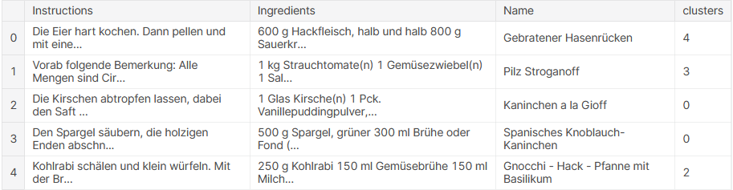
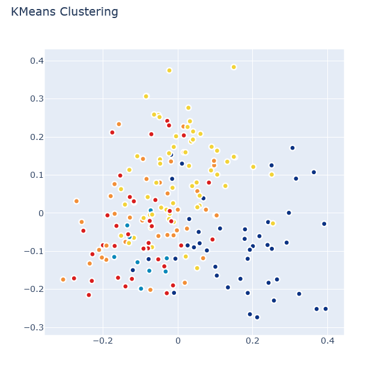
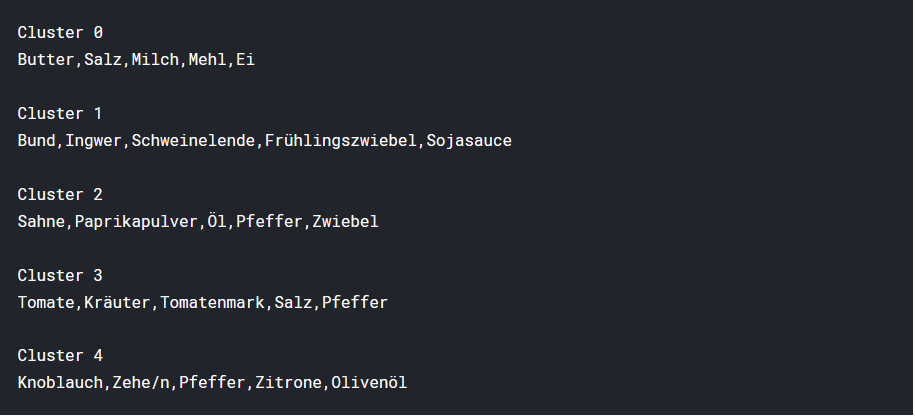
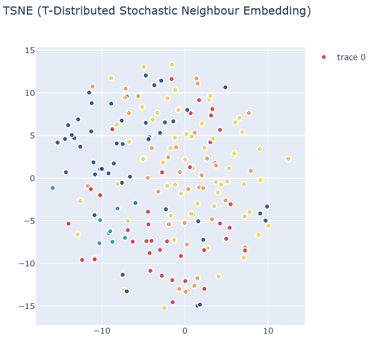

# Clustering-of-Deutsch-Recipes

## Clustering of Deutsch Recipes into 3 different clusters using t-SNE and K-Means.

**Author**: **SHAILESH DHAMA**

The contents of this repository is a detailed analysis of the project. This analysis intends in the hopes of making the work accessible and replicable.

### Data:

This dataset contains 12190 german recipes with metadata crawled from chefkoch.de

## Steps:

- Data Cleansing and Processing. 
- Stemming and Tokenization.
- Vectorisation using tfidf_vectorizer(fitting it with "plot" to create vectors)
- Perform Principal component analysis (PCA) for dimensioanl reduction.
- Clustering using K-Means and visualise the same.
- Clustering using t-SNE and visualise the same.

## Results:

#### K-Means

> Table comprising of detailed clusters.

#### K-Means Visualisation

> Result of K-Means graphically.

#### t-SNE

> Five Types Of Clusters obtained  after employing t-SNE.

#### t-SNE Visualisation

> Result of t-SNE graphically.

### For further information:-

Please review the narrative of our analysis in [our jupyter notebook](./b-ndelung-deutscher-rezepte.ipynb)
For any additional questions, please contact **shaileshshettyd@gmail.com)


##### Repository Structure:

Here is where you would describe the structure of your repoistory and its contents, for exampe:

```

├── README.md                                    <- The top-level README for reviewers of this project.
├── b-ndelung-deutscher-rezepte.ipynb            <- narrative documentation of analysis in jupyter notebook
└── images                                       <- both sourced externally and generated from code

```
